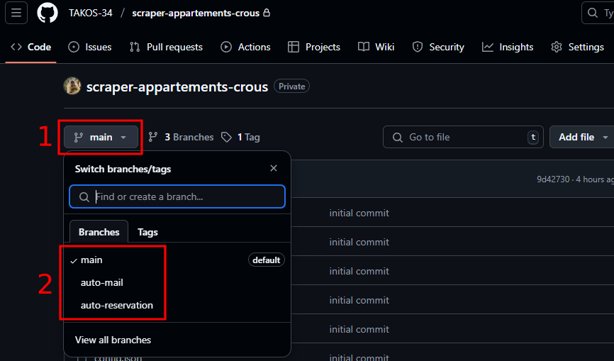
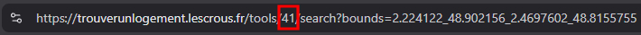

# TUTO - UTILISATION D'UN BOT SCRAPER POUR TROUVER UN APPARTEMENT CROUS

Le but du projet est de vous aider à obtenir un appartement CROUS, ce qui peut être assez dur si vous avez un échelon assez bas, voire si vous n'êtes même pas boursier. Un bot pourra donc, en fonction de vos préférences, vous envoyer par mail une liste d'appartements disponibles selon votre secteur et vos critères, voire il pourra même réserver à votre place, même si la procédure est légèrement plus lourde. Tout a été fait pour que même ceux qui n'y connaissent rien puissent y arriver. Il va falloir ouvrir un terminal, donc ça peut faire peur, mais il n'y a rien de compliqué.

## Avant toute chose

Il existe trois versions de ce bot, vous pouvez changer la version en changeant de branche, comme le montre l'image ci-dessous :

Voici ce que fait le bot en fonction de sa version :
- `main` : Le bot vous enverra un mail avec tous les appartements disponibles selon votre secteur et vos critères dans un mail listant les appartements disponibles, leurs caractéristiques et le lien pour les consulter sur le site du CROUS. Dans cette version, aucune connexion n'est nécessaire, mais il y aura moins d'appartements proposés
- `auto-mail` : Le bot vous enverra un mail avec tous les appartements disponibles selon votre secteur et vos critères dans un mail listant les appartements disponibles, leurs caractéristiques et le lien pour les consulter sur le site du CROUS. Dans cette version, une connexion est nécessaire au compte et il faudra alors récupérer son token d'authentification, mais tout vous sera expliqué si vous sélectionnez cette branche dans ce README
- `auto-reservation` : Le bot réservera le premier appartement disponible selon votre secteur et vos critères, il enverra un mail vous disant s'il a réussi la réservation ou bien s'il a échoué ainsi que la raison de l'échec. Dans cette version, une connexion est nécessaire au compte et il faudra alors récupérer son token d'authentification, mais tout vous sera expliqué si vous sélectionnez cette branche dans ce README

Nous sommes ici dans la version `auto-reservation` du README.

## 1ère Étape : Créer un mot de passe d'application à utiliser pour l'email

On utilisera Google, donc vous pouvez utiliser votre compte ou en créer un nouveau. Vous pouvez utiliser un autre service mais il faudra ajuster le code selon vos besoins (dans le fichier `mail.js`, qui se trouve dans le dossier `config`).

- Allez sur les paramètres de votre compte Google
- Cherchez dans la barre de recherche : Mots de passe des applications
- Saisissez votre mot de passe
- Créez un nouveau mot de passe d'application, remplissez le champ "Nom de l'appli" avec ce que vous voulez, exemple : "CROUS" et cliquez sur créer
- Le plus important, gardez le mot de passe qui sera affiché, il devrait ressembler à quelque chose comme ceci : `iaip wwea yypm xznp`

Ensuite on peut aller dans le fichier `config.json` :

- Ligne 5 : Remplir le champ user avec ce que vous voulez, ce sera le nom affiché dans l'email
- Ligne 6 : Remplir le champ user_email par votre email
- Ligne 7 : Remplir le champ user_password par le mot de passe d'application précédemment créé

## 2ème Étape : Récupérer son token de connexion

Pour pouvoir faire une réservation à votre nom, il faut récupérer votre token de connexion. La manière la plus simple de le garder actif est un peu rudimentaire mais elle fonctionne. Il faudra d'une quelconque manière vous connecter sur le site de logement CROUS et faire en sorte de rafraîchir la page toutes les 30 secondes. Vous pouvez faire cela via une extension (https://autorefresh.io/) ou par d'autres moyens qui vous semblent appropriés. Ceci est indispensable car sinon votre session se coupera et le token que l'on va récupérer juste après deviendra inutilisable.

Une fois connecté, récupérez votre token de connexion. Allez sur la page de logement CROUS, appuyez sur `F12` (ou faites clic droit n'importe où sur la page puis inspecter), puis dans `Application` ou `Stockage` (selon Chrome / Firefox), sélectionnez `cookies`, puis `https://trouverunlogement.lescrous.fr/`, et récupérez la valeur de `PHPSESSID` et de `qpid`. Allez dans le fichier `config.json` et mettez la valeur de `PHPSESSID` dans `php_sess_id` ligne 8 et le `qpid` dans `qpid` ligne 9, voir l'image ci-dessous :

Il faut en dernier récupérer l'id de votre panier. Cliquez sur mon dossier en haut à droite, appuyez sur `F12` (ou faites clic droit n'importe où sur la page puis inspecter), puis dans `Network` ou `Réseau` (selon Chrome / Firefox), filtrez par XHR pour ne voir que les requêtes spécifiques que nous cherchons et cherchez la requête nommée `cart`. Cliquez ensuite dessus et sélectionnez `Response` ou `Réponse` (selon Chrome / Firefox), récupérez l'id, qui correspond à votre id de panier, voir l'image ci-dessous :

Allez ensuite dans le fichier `config.json` et mettez la valeur récupérée précédemment dans `cart_id` ligne 10.

## 3ème Étape : Lancer l'application

- Téléchargez nodejs (https://nodejs.org/fr)
- Lancez un terminal (je vous laisse regarder comment faire sur internet / demander à une IA) dans le dossier du projet et faites les commandes suivantes :
- `npm i` (Installer les dépendances)
- `npm start` (Lancer l'application)

L'application fonctionne directement, il suffit de la laisser tourner sur votre ordinateur autant de temps que vous le souhaitez et vous recevrez un mail en fonction des paramètres mis. Le premier appartement disponible sera réservé et vous recevrez un email vous informant de sa réservation ou d'un éventuel problème.

## 4ème Étape : Les paramètres (localisation, prix, surface, ...)

Tout se passe dans le fichier `config.json` :

- idTool - Ligne 2 : Cherchez un appartement pour votre ville et récupérez le numéro de l'url entre tools/ et /search, voir l'image ci-dessous :

- Localisation - Lignes 15 à 18 : Ici sont les coordonnées de la ville recherchée. Il suffit de les remplacer par les vôtres. Allez sur le site du CROUS, faites une recherche d'appartement dans votre ville et regardez les chiffres en paramètres de l'url, voir l'image ci-dessous :

- Prix maximum - Ligne 19 : Mettez le prix maximum souhaité avec le chiffre sans virgule, soit 5 chiffres. Par exemple si vous voulez maximum 250€ mettez 25000, car ce sera interprété comme 250.00. Par défaut la valeur est 10000000 afin d'avoir le maximum de propositions possible

- Surface minimum - Ligne 20 : Mettez ce que vous voulez. Par exemple si vous voulez 9m² minimum, mettez 9. Si vous voulez 18m² minimum, mettez 18. Par défaut la valeur est 0 pour la même raison que pour le prix maximum

- Type d'occupation - Ligne 21 : Ceci est un choix multiple entre Seul (`alone`), Couple (`couple`) et Colocation (`house_sharing`). Si vous souhaitez Seul mettez : ["alone"], si vous souhaitez seul ou colocation mettez : ["alone", "house_sharing"]. Si vous souhaitez les trois : ["alone", "couple", "house_sharing"]. Par défaut seul est sélectionné

- Équipements - Ligne 22 : Choix multiple avec les équipements entre `WC`, `Douche`, `Frigo`, `Evier + plaque` et `Balcon`. Si vous voulez des toilettes, douche et frigo mettez : ["WC", "Douche", "Frigo"]. Si vous voulez cela et une cuisine alors : ["WC", "Douche", "Frigo", "Evier + plaque"]

- Noms - Ligne 23 : Vous pouvez mettre des noms de résidences sous forme de liste (en minuscules), par exemple : ["maison des etudiants", "bazeilles"]. Si vous ne mettez rien il n'y aura aucun filtre et tout sera sélectionné peu importe le nom de la résidence

Une fois l'application relancée, tous les filtres seront appliqués et le premier appartement trouvé répondant à vos critères sera automatiquement réservé.

## Autres informations bonus

- Délai - Lignes 27 & 28 : `delaie` est le délai fixe minimum entre les requêtes et `delaie_supp` un délai en plus aléatoire entre 0 et la valeur choisie. Par exemple avec le choix de base ce sera 5 + 5, soit 5 secondes minimum + un délai aléatoire entre 0 et 5 secondes. Vous pouvez le modifier si vous voulez

- Si jamais le bot ne fonctionne pas vérifiez bien que vous avez mis les bons paramètres et pensez à tester sur des zones avec des appartements déjà disponibles

- Si vous préférez lancer le bot sur autre chose que votre ordinateur personnel il existe des solutions en ligne, comme Glitch. Sinon si vous avez un VPS ça marche très bien aussi. Le mieux c'est de laisser tourner le bot sur un vieux pc qui traîne